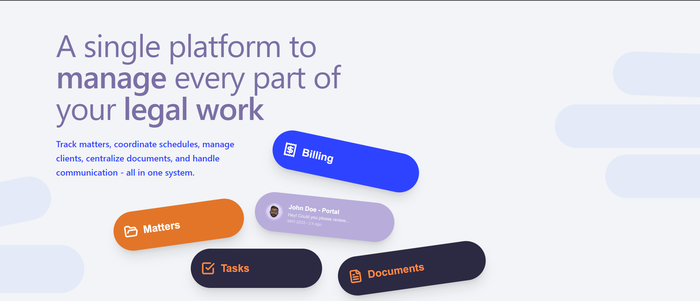

# Floating Hero Section 




Hi there! 👋 This is a super cool landing page I built using Next.js. It features a floating hero section with some really nice animations and cards that look like they are floating in space!

I tried to make it look exactly like the design, and I think it turned out pretty great. The cards are positioned carefully, and it even works on mobile phones!

## What's Inside? 

-   **Floating Cards**: Cool cards that float around.
-   **Responsive Design**: Looks good on your laptop and your phone.
-   **Custom Fonts**: Used some fancy fonts to make it look professional.

## How to Run It 

If you want to see this project on your own computer, it's really easy. Just follow these steps:

1.  **Open your terminal**: You can use Command Prompt, PowerShell, or the terminal in VS Code.
2.  **Install dependencies**: Run this command to get all the tools we need:
    ```bash
    npm install
    ```
3.  **Start the server**: Now, let's turn it on!
    ```bash
    npm run dev
    ```
4.  **View it**: Open your web browser and go to `http://localhost:3000`.

## Tech Stack 

Built using **Next.js** and **Tailwind CSS**.